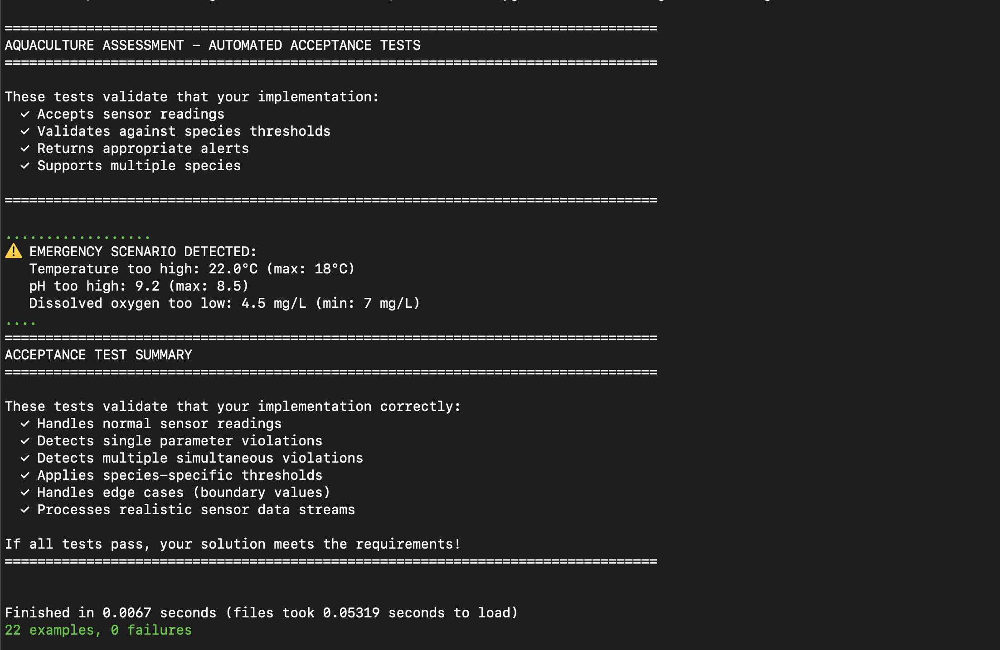

# Aquaculture Water Quality Monitoring System

---

### Overview
This application monitors **water quality parameters** in aquaculture tanks and generates **alerts** when conditions fall outside safe ranges for specific aqua species.

---

### How to use this
```bash
1. git clone https://github.com/dipeshbirla/aquaculture-water-quality-checker.git
2. cd aquaculture-water-quality-checker
```

### Install Dependencies

```bash
# Install RSpec and other gems
bundle install
```

### Entry point
use command
- ruby lib/aquaculture.rb

---

### Add new species

Example class

```ruby
# lib/aquaculture/species_profile/trout_profile.rb
class TroutProfile < BaseProfile
  def thresholds
    {
      temperature: { min: 10, max: 16 },
      ph: { min: 6.8, max: 8.0 },
      dissolved_oxygen: { min: 8 }
    }
  end
end
```
---

### Implemention:
1) Added the entry point file(/lib/aquaculture.rb)
2) For species used the Strategy design pattern
3) Added tests cases for added classes.

---

### Proof of acceptance
**Screenshot of all acceptance test passed**



---

### Project File Structure

```
.
├── lib/
│   ├── aquaculture/
│       ├── sensor_reading.rb
│       ├── water_quality_checker.rb         #quality checking logic 
│       ├── aquaculture.rb                   # main entry point        
│       └── species_profile/                 #all species profiles(Add new species under this)
│           ├── base_profile.rb
│           ├── salmon_profile.rb
│           └── tilapia_profile.rb
│
├── spec/                                     #test cases
│   ├── spec_helper.rb
│   ├── sensor_reading_spec.rb
│   ├── water_quality_checker_spec.rb
│   ├── shared_examples/                      #shared examples
│   │   ├── species_profile_spec.rb
│   └── species_profile/
│       ├── base_profile_spec.rb
│       ├── salmon_profile_spec.rb
│       ├── tilapia_reading_spec.rb
│
├── acceptance_tests_spec.rb
├── sensor_data_generator.rb
├── ASSIGNMENT.md
├── TESTING_INSTRUCTIONS.md
└── README.md

```
---

### Repository Checklist

- [x] All implementation files committed
- [x] Your own tests included
- [x] README with setup instructions
- [x] Proof that acceptance tests pass (screenshot or CI)
- [x] Clean git history (meaningful commits)
- [x] Repository link shared
